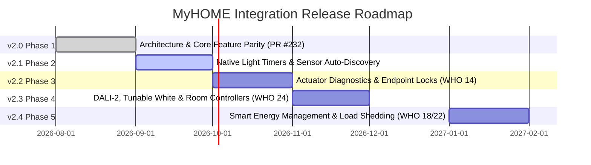

# MyHOME for Home Assistant — Project Roadmap & Milestones

Welcome to the official development roadmap for the **MyHOME for Home Assistant** integration.

Our overarching mission is to provide the most reliable, complete, and high-performance integration between Home Assistant and the BTicino / Legrand SCS OpenWebNet ecosystem. We adhere to strict standards: **zero-latency asynchronous architecture**, **hardware-level protocol fidelity**, **100% automated test coverage**, and **full Home Assistant Core 2025/2026 compatibility**.

---

## 🗺️ Release Milestones Overview

---

## 🚀 Milestone Details

### ✅ v2.0 — Phase 1: Architecture Modernization & Core Feature Parity (Current)
*Target: [PR #232](https://github.com/OpenWebNet-HA/MyHOME/pull/232) — September 2026*

The foundational rebuild of the integration engine, eliminating legacy concurrency locks, race conditions, and deprecation warnings while ensuring full feature parity for all primary residential subsystems.

- **Dual Async Transports**:
  - Unified asynchronous TCP (`AsyncTcpTransport`) and Serial/USB (`AsyncSerialTransport`).
  - Native support for **Legrand 3578 OpenZigBee USB interfaces** with auto-port detection and baudrate negotiation.
- **Declarative Gateway Profiles & Adaptive Pacing**:
  - Tuned session concurrency and token-bucket pacing (e.g. 150 ms for MH200, 80 ms for F454, 30 ms for MyHomeServer1).
- **Stream Framing & Connection Watchdog**:
  - Chunk-free `readuntil(b"##")` stream delimiter parsing.
  - Active keep-alive supervisor with exponential backoff and fail-closed authentication (HMAC-SHA256, HMAC-SHA1, OpenWebNet password hashing).
- **In-Band Lovelace Bus Monitor Card (`<myhome-bus-card>`)**:
  - Real-time diagnostic WebSocket ring buffer, WHO filtering, command injection, and 1-click diagnostic clipboard reports for GitHub issues.
- **Full Subsystem Feature Parity**:
  - **Covers (WHO = 2)**: Virtual travel-time positioning interpolation, target positioning (`set_cover_position`), and native WHO=2 dimension 10 support.
  - **Dry Contacts & AUX (WHO = 25)**: Dynamic discovery, inverted logic, and event dispatching for Legrand 3477 binary sensors.
  - **Burglar Alarm Platform (WHO = 5)**: Complete `alarm_control_panel` supporting Arm Away, Arm Home, Disarm, and Panic triggers with broadcast and partition addressing.
  - **Fancoil Thermoregulation (WHO = 4)**: 3-speed fancoil control (`auto`, `low`, `medium`, `high`) using dimension 11, offset tracking, and startup sweeps.
- **Quality**: **754 unit tests passing with 100% statement and branch coverage** across all 30 component modules.

---

### 📋 v2.1 — Phase 2: Native Bus Timers & Environmental Auto-Discovery
*Target: Q4 2026*

Bringing hardware-offloaded timing and zero-configuration discovery to sensors and lighting.

- **⏱️ Native Bus Light Timers (`WHO = 1`)**:
  - Expose a first-class `myhome.turn_on_timed` service directly in the integration (as well as an optional `timer` parameter for `light.turn_on`).
  - Offload countdown execution directly to the SCS light actuator hardware using native WHAT codes (18 = 0.5s, 17 = 30s, 11 = 1m, 12 = 2m, 13 = 3m, 14 = 4m, 15 = 5m, 16 = 15m) and custom Dimension 2 (`*#1*<WHERE>*#2*H*M*S##`).
  - Ensures staircases, garages, and corridors turn off reliably even if Home Assistant restarts or network disconnects.
  - *Attribution & Idea*: Inspired by **@GianlucaCh** ([GianlucaCh/Myhome-Timer](https://github.com/GianlucaCh/Myhome-Timer)).
- **☀️ Dynamic Discovery for Illuminance & Motion Sensors (Legrand 048834)**:
  - Extend dynamic bus discovery to illuminance sensors when lux frames appear (`WHO = 1` Dimension 6 and `WHO = 24` Dimension 18), eliminating manual YAML entry for light sensors.
  - *Attribution & Idea*: Requested by **@anotherjulien** based on real-world outdoor detector setups.
- **🔍 Passive Bus Sniffing & Topology Auto-Mapping**:
  - Automatically detect and catalog active SCS addresses during initial setup.

---

### 📋 v2.2 — Phase 3: Actuator Diagnostics & Endpoint Safety Locks (WHO = 14)
*Target: Q4 2026*

Advanced actuator health telemetry and maintenance lock controls.

- **🔒 Endpoint Lock / Unlock Controls**:
  - Provide switch or lock entities to assert hardware locks on specific APL endpoints to prevent accidental physical switching during maintenance or security states.
  - *Attribution & Idea*: Highlighted by **@anotherjulien**.
- **📊 Actuator Diagnostics**:
  - Monitor relay health, operating cycle counters, and diagnostic failure codes directly from supporting DIN actuators.

---

### 📋 v2.3 — Phase 4: Extended Lighting, Tunable White & DALI-2 (WHO = 1 & WHO = 24)
*Target: Q1 2027*

Next-generation lighting control enabled by our verified protocol archive.

- **🎨 Advanced Lighting & Color Control**:
  - Tunable white (color temperature `kelvin` / `mireds`) and RGB/RGBW color control for DALI ballasts via **F429 / F429G**.
  - Configurable dimming speed profiles and smooth transition curves.
- **🏢 Lighting Management Room Controllers (WHO = 24)**:
  - Native integration for Legrand Lighting Management central units (**BMNE500 / 002645**, **BMview**, **Lighting Console**).
  - Maintained lux level regulation, daylight harvesting setpoints, and profile activation frames (`*24*1#Profile_ID*WHERE##`).
  - *Attribution*: Enabled by the **`WHO_24.pdf`** specification verified and contributed by **@GianlucaCh**.

---

### 📋 v2.4 — Phase 5: Smart Energy Management & Dynamic Load Shedding (WHO = 18 & WHO = 22)
*Target: Q1 2027*

Comprehensive home energy observability and grid-aware load balancing.

- **⚡ New-Generation Load Control (WHO = 22)**:
  - Central unit load management (**F522 / F523**) with dynamic disconnection priorities, per-phase threshold monitoring, and manual force/inhibit overrides.
- **📈 Advanced Energy Metering (WHO = 18)**:
  - Multi-tariff smart metering, reactive power, power factor, line voltage, and cumulative pulse counters wired directly into the Home Assistant Energy Dashboard.

---

## 🏆 Community Contributor Hall of Fame

This project thrives because of active collaboration between homeowners, certified installers, and open-source developers. We extend our sincere gratitude to:

- **[@anotherjulien](https://github.com/anotherjulien)**: Creator of the original OpenWebNet integration and foundational maintainer. Invaluable real-world VM testing and plant verification across Legrand 67557 advanced covers, 3477 dry contacts, 048834 multi-sensors, and WHO 14 actuator lock concepts.
- **[@GianlucaCh](https://github.com/GianlucaCh)**: For preserving and contributing the missing official **`WHO_24.pdf`** Lighting Management specification and designing native SCS hardware timer temporization ([Myhome-Timer](https://github.com/GianlucaCh/Myhome-Timer)).
- **[@xtimmy86x](https://github.com/xtimmy86x)** & **[@lyubomirtraykov](https://github.com/lyubomirtraykov)**: Certified BTicino installers and software specialists providing crucial insights into scenario programmer quirks (MH200/MH201/MH202), cross-bus gateway interface routing (F422), and real-world bus traces.

---

> **💡 Have an idea or device trace to contribute?** Open an issue on [OpenWebNet-HA/MyHOME](https://github.com/OpenWebNet-HA/MyHOME/issues) or join the discussions in [PR #232](https://github.com/OpenWebNet-HA/MyHOME/pull/232).
