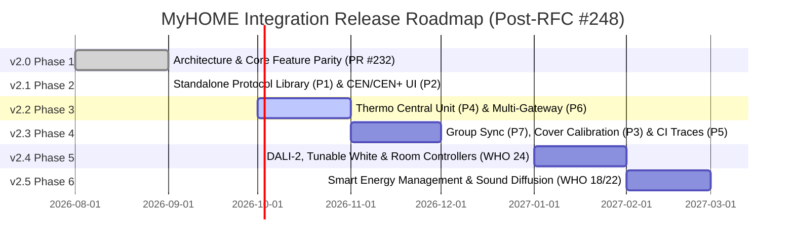

# MyHOME for Home Assistant — Project Roadmap & Milestones

Welcome to the official development roadmap for the **MyHOME for Home Assistant** integration.

Our overarching mission is to provide the most reliable, complete, and high-performance integration between Home Assistant and the BTicino / Legrand SCS OpenWebNet ecosystem. We adhere to strict standards: **zero-latency asynchronous architecture**, **hardware-level protocol fidelity**, **100% automated test coverage**, and **full Home Assistant Core 2025/2026 compatibility**.

---

## 🗺️ Release Milestones Overview

---

## 🗳️ Community RFC #248 Consensus & Priority Ranking

In September 2026, following the migration to the [OpenWebNet-HA organization](https://github.com/OpenWebNet-HA), the project opened [**RFC Discussion #248**](https://github.com/orgs/OpenWebNet-HA/discussions/248) to conduct an objective gap analysis against mature OpenWebNet platforms (notably Massimo Valla's [`openwebnet4j`](https://github.com/mvalla/openwebnet4j) and the openHAB OpenWebNet Binding) and rank future development priorities (**P1 – P7**).

### Community Priority Rankings
- **[@anotherjulien](https://github.com/anotherjulien)** (Original integration creator):
  $$\text{P1} \gt \text{P2} \gt \text{P3} \gt \text{P4} \gt \text{P5} \gt \text{P6} \gt \text{P7}$$
  *Key takeaway*: Extracting the protocol engine into a standalone library (P1) is foundational architectural work that must precede all other major changes.
- **[@mvalla](https://github.com/mvalla)** (Author of `openwebnet4j` & openHAB OpenWebNet binding):
  $$\text{P1} \gt \text{P2} \gt \text{P4} \gt \text{P6} \gt \text{P7} \gt \text{P3} \gt \text{P5}$$
  *Key takeaway*: P1 and P2 are top priorities, followed immediately by Thermoregulation Central Unit (P4) and Multi-Gateway support (P6).
- **[@daniedj](https://github.com/daniedj)**:
  Prioritized **P3 (Cover Calibration)** for installations running physical MH201 gateways with F411/4 shutter actuators and HD4695 central units.

### Key Architectural Clarifications from RFC #248
1. **The Rationale for P7 (Lighting Groups & General Sync)**:
   While SCS actuators ideally broadcast status changes after executing a group or general command (`WHERE=0` / `#group`), real-world gateways (and certain area configurations) often fail to emit individual status messages. P7 state reflection prevents Home Assistant entity states from falling out of sync with physical lighting states.
2. **Audio Streaming & Matrix Architecture (F441 / F441M)**:
   The F441 matrix is a pure analog hardware matrix without network streaming or DAC hardware. Digital music streaming into BTicino audio zones is achieved using the **Dynamic Proxy** pattern: an external network streamer (e.g., WiiM, Raspberry Pi running Squeezelite, Cambridge Audio) feeds an analog input (IN 1–4) on the F441, with Home Assistant automatically waking the streamer, unmuting the zone amplifier, and syncing playback controls. Direct UI source switching (`*16*3*1XY##`) is deferred to avoid relay clicking and noise on older gateways.
3. **Video Door Entry Intercom Hardware Limits (F453AV & Classe 100/300)**:
   Legacy gateways like the F453AV do not expose RTSP video streams or bidirectional network audio; video is limited to low-resolution HTTP JPEG frames (`telecamera.php`), and intercom audio is strictly analog on the 2-wire SCS bus. Two-way video/audio intercom into Home Assistant requires tapping analog feeds with an external RTSP/IP encoder (e.g. `go2rtc`) or dedicated modern bridge hardware.

---

## 🚀 Milestone Details

### ✅ v2.0 — Phase 1: Architecture Modernization & Core Feature Parity (Current)
*Target: [PR #232](https://github.com/OpenWebNet-HA/MyHOME/pull/232) — September 2026*

The foundational rebuild of the integration engine, eliminating legacy concurrency locks, race conditions, and deprecation warnings while ensuring full feature parity for all primary residential subsystems.

- **Dual Async Transports**:
  - Unified asynchronous TCP (`AsyncTcpTransport`) and Serial/USB (`AsyncSerialTransport`).
  - Native support for **Legrand 3578 OpenZigBee USB interfaces** with auto-port detection and baudrate negotiation.
- **Declarative Gateway Profiles & Adaptive Pacing**:
  - Tuned session concurrency and adaptive inter-frame pacing (e.g. 150 ms for MH200, 80 ms for F454, 30 ms for MyHomeServer1).
- **Stream Framing & Connection Watchdog**:
  - Chunk-free `readuntil(b"##")` stream delimiter parsing.
  - Active keep-alive supervisor with exponential backoff and fail-closed authentication (HMAC-SHA256, HMAC-SHA1, OpenWebNet password hashing).
- **In-Band Lovelace Bus Monitor Card (`<myhome-bus-card>`)**:
  - Real-time diagnostic WebSocket ring buffer, WHO filtering, command injection, and 1-click diagnostic clipboard reports for GitHub issues.
- **Full Subsystem Feature Parity**:
  - **Covers (WHO = 2)**: Virtual travel-time positioning interpolation, target positioning (`set_cover_position`), and native WHO=2 dimension 10 support.
  - **Dry Contacts & AUX (WHO = 25)**: Dynamic discovery, inverted logic, and event dispatching for Legrand 3477 binary sensors.
  - **Burglar Alarm Platform (WHO = 5)**: Complete `alarm_control_panel` supporting Arm Away, Arm Home, Disarm, and Panic triggers with broadcast and partition addressing.
  - **Fancoil Thermoregulation (WHO = 4)**: 3-speed fancoil control (`auto`, `low`, `medium`, `high`) using dimension 11, offset tracking, and startup sweeps.
- **Quality**: **846+ unit tests passing with 100% statement and branch coverage** across all component modules.

---

### ✅ v2.1 — Phase 2: Standalone Protocol Library (P1), Native CEN/CEN+ Triggers (P2) & Native Bus Timers
*Target: v2.0.0b11 — September 2026 (Completed)*

Focusing on the top two community-ranked priorities from RFC #248: decoupling the core protocol engine and providing first-class UI triggers for scenario control panels.

- **📦 Extract & Type the Python OpenWebNet Protocol Engine (P1)**:
  - Extracted `custom_components/myhome/ownd/` into an independent, strongly typed Python package (`OWNd 2.0.0b5`) published live to PyPI.
  - Provided strongly typed message models (`Lighting.request_turn_on("51")`) shared seamlessly between Home Assistant and the `myhome-gateway` MCP server.
  - Eliminated code duplication and established clean semantic versioning for protocol parsing.
- **🎛️ Native CEN / CEN+ Device Triggers & Switch Devices (P2)**:
  - `device_trigger.py` filters directly on scenario device addresses (`object`).
  - Registered physical wall scenario control panels as distinct devices in Home Assistant's `device_registry`.
  - Provided native Home Assistant UI automations for **Short Press**, **Long Press**, and **Release** events, making external community YAML blueprints optional.
- **⏱️ Native Bus Light Timers (`WHO = 1`)**:
  - Exposed a first-class `myhome.turn_on_timed` service directly in the integration (as well as an optional `timer` / `duration` parameter for `light.turn_on` and `switch.turn_on`).
  - Offloaded countdown execution directly to SCS light actuator hardware using native WHAT codes (18 = 0.5s, 17 = 30s, 11 = 1m, 12 = 2m, 13 = 3m, 14 = 4m, 15 = 5m, 16 = 15m) and custom Dimension 2 (`*#1*<WHERE>*#2*H*M*S##`).
  - *Attribution & Idea*: Inspired by **@GianlucaCh** ([GianlucaCh/Myhome-Timer](https://github.com/GianlucaCh/Myhome-Timer)).
- **☀️ Dynamic Discovery for Illuminance & Motion Sensors (Legrand 048834)**:
  - Extended dynamic bus discovery to illuminance sensors when lux frames appear (`WHO = 1` Dimension 6 and `WHO = 24` Dimension 18), eliminating manual YAML entry for light sensors.

---

### 📋 v2.2 — Phase 3: Thermoregulation Central Unit (P4) & Multi-Gateway Architecture (P6)
*Target: Q4 2026*

Implementing high-priority climate coordination and multi-bridge topology isolation.

- **🌡️ Thermoregulation Central Unit (3550 / 4695 / HD4695) (P4)**:
  - Implement a dedicated Central Unit entity (`MyHOMEThermoCentralUnit`) representing 4-zone and 99-zone master controllers.
  - Provide controls to switch master heating/cooling seasonal modes, holiday programs, and manual setpoints across all zones directly from Home Assistant.
- **🌐 Multi-Gateway Architecture (P6 - Issue #128)**:
  - Namespace all internal Home Assistant event dispatchers by gateway MAC/entry ID.
  - Enable seamless multi-bridge topologies (e.g. MH200N dedicated to scenario programming alongside an F454 / MyHomeServer1 handling lighting and thermoregulation) without event collisions or cross-talk.
- **🔒 Endpoint Safety Locks & Actuator Diagnostics (WHO = 14)**:
  - Provide switch/lock entities to assert hardware safety locks on specific APL endpoints to prevent physical switching during maintenance or security states.
  - Monitor relay operating cycle counters and diagnostic failure codes from supporting DIN actuators.

---

### 📋 v2.3 — Phase 4: State Synchronization (P7), Cover Calibration (P3) & Trace Replay (P5)
*Target: Q1 2027*

Closing remaining protocol fidelity gaps identified in the openHAB / openwebnet4j comparison.

- **💡 Lighting Groups & General Sync (P7)**:
  - Intercept bus group actuations (`#group`) and general commands (`WHERE=0`) on the SCS bus.
  - Automatically reflect changes onto individual Home Assistant entity states, eliminating desynchronization on gateways that do not broadcast individual device status messages.
- **🪟 Cover Calibration & Dynamic Hardware Position Promotion (P3)**:
  - Dynamically promote discovered covers to advanced positioning when dimension 10 frames arrive from Legrand 67557 / LN4672M2 / F401 actuators.
  - Implement a calibration service (`shutterRun=AUTO`) to measure actual physical run times directly from the bus rather than relying on manual travel time estimation.
- **🧪 Real-World Gateway Trace Replay Fixtures in CI (P5)**:
  - Build an automated pytest fixture harness replaying frozen bus captures recorded from real-world gateways (MH200, F454, MyHomeServer1, 3578 USB) via `<myhome-bus-card>`.
  - Prevent subtle gateway-specific timing and framing regressions from ever reaching master.

---

### 📋 v2.4 — Phase 5: Extended Lighting, Tunable White & DALI-2 (WHO = 1 & WHO = 24)
*Target: Q1 2027*

Next-generation lighting control enabled by verified protocol specifications.

- **🎨 Advanced Lighting & Color Control**:
  - Tunable white (color temperature `kelvin` / `mireds`) and RGB/RGBW color control for DALI ballasts via **F429 / F429G**.
  - Configurable dimming speed profiles and smooth transition curves.
- **🏢 Lighting Management Room Controllers (WHO = 24)**:
  - Native integration for Legrand Lighting Management central units (**BMNE500 / 002645**, **BMview**, **Lighting Console**).
  - Maintained lux level regulation, daylight harvesting setpoints, and profile activation frames (`*24*1#Profile_ID*WHERE##`).
  - *Attribution*: Enabled by the **`WHO_24.pdf`** specification contributed by **@GianlucaCh**.

---

### 📋 v2.5 — Phase 6: Smart Energy Management & Advanced Sound Diffusion (WHO = 18 & WHO = 22)
*Target: Q2 2027*

Comprehensive energy monitoring, grid-aware load balancing, and dedicated multi-room audio source control.

- **⚡ Energy Management & Smart Metering (WHO = 18)**:
  - Multi-function energy meters and central units (**F520 / F521 / F522 / F523 / 3522**) with instantaneous power (W), line voltage (V), current (mA), power factor, tariff periods, and cumulative pulse counters wired directly into the Home Assistant Energy Dashboard.
- **🎵 Sound Diffusion Source & Speaker Navigation (WHO = 22)**:
  - Advanced audio source navigation for multi-room systems: FM tuner frequency stepping, station preset selection, track skipping, RDS metadata display streaming (`*22*31...`), and speaker attenuation.
  - Continued refinements to the F441 Dynamic Proxy pattern for network audio streamers.

---

## 🏆 Community Contributor Hall of Fame

This project thrives because of active collaboration between homeowners, certified installers, and open-source developers. We extend our sincere gratitude to:

- **[@anotherjulien](https://github.com/anotherjulien)**: Creator of the original OpenWebNet integration and foundational maintainer. Invaluable real-world VM testing, plant verification across Legrand 67557 covers, 3477 dry contacts, 048834 multi-sensors, and active RFC #248 priority review.
- **[@mvalla](https://github.com/mvalla)** (Massimo Valla): Creator of [`openwebnet4j`](https://github.com/mvalla/openwebnet4j) and the openHAB OpenWebNet binding. Invaluable contributor to the RFC #248 architectural gap analysis, priority ranking, and technical clarification on group/general command state reflection.
- **[@GianlucaCh](https://github.com/GianlucaCh)**: For preserving and contributing the comprehensive 15-manual BTicino / Legrand specification archive (`OWN DOC.zip`) covering WHO 0, 1, 2, 4, 5, 7, 13, 15/25, 17, 18, 22, 24, 25, HMAC authentication, and architecture intro; designing native SCS hardware timer temporization ([Myhome-Timer](https://github.com/GianlucaCh/Myhome-Timer)); and highlighting the community CEN+ automation blueprint.
- **[@xtimmy86x](https://github.com/xtimmy86x)** & **[@lyubomirtraykov](https://github.com/lyubomirtraykov)**: Certified BTicino installers and software specialists providing crucial insights into scenario programmer quirks (MH200/MH201/MH202), cross-bus gateway interface routing (F422), and real-world bus traces.
- **[@daniedj](https://github.com/daniedj)** & **[@wave68runner](https://github.com/wave68runner)**: Community hardware testers providing real-world traces and testing on MH201, BT-HD4695, F453AV, MyHomeServer1, and F441 sound diffusion hardware.

---

> **💡 Have an idea or device trace to contribute?** Join the ongoing discussion in [**RFC Discussion #248**](https://github.com/orgs/OpenWebNet-HA/discussions/248) or open an issue on [OpenWebNet-HA/MyHOME](https://github.com/OpenWebNet-HA/MyHOME/issues).
